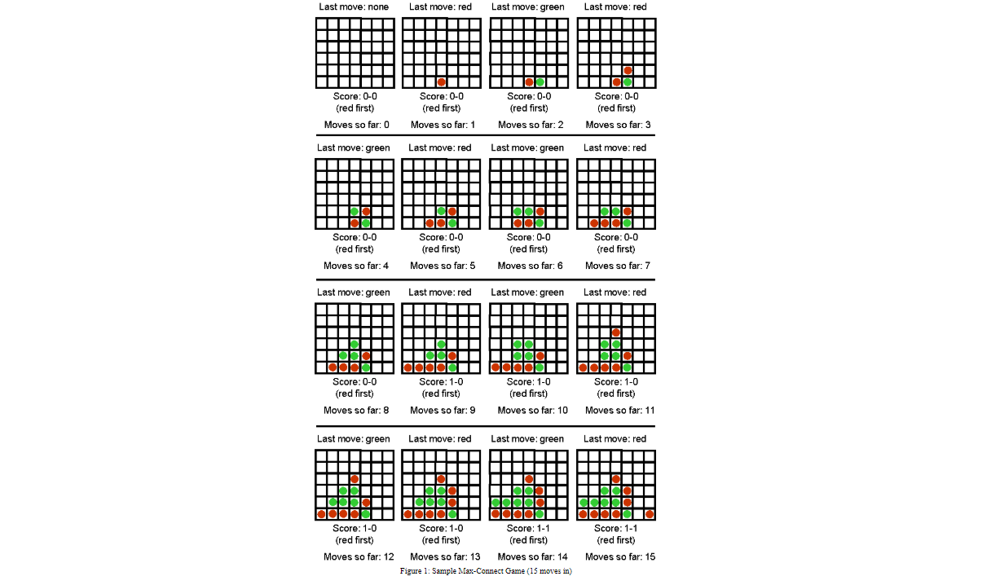

# minmax_connect_four
This is to implement an agent that plays the Max-Connect4 game using search. Figure 1 shows the first few moves of a game. The game is played on a 6x7 grid, with six rows and seven columns. There are two players, player A (red) and player B (green). The two players take turns placing pieces on the board: the red player can only place red pieces, and the green player can only place green pieces.

It is best to think of the board as standing upright. We will assign a number to every row and column, as follows: columns are numbered from left to right, with numbers 1, 2, ..., 7. Rows are numbered from bottom to top, with numbers 1, 2, ..., 6. When a player makes a move, the move is completely determined by specifying the COLUMN where the piece will be placed. If all six positions in that column are occupied, then the move is invalid, and the program should reject it and force the player to make a valid move. In a valid move, once the column is specified, the piece is placed on that column and "falls down", until it reaches the lowest unoccupied position in that column.

The game is over when all positions are occupied. Obviously, every complete game consists of 42 moves, and each player makes 21 moves. The score, at the end of the game is determined as follows: consider each quadruple of four consecutive positions on board, either in the horizontal, vertical, or each of the two diagonal directions (from bottom left to top right and from bottom right to top left). The red player gets a point for each such quadruple where all four positions are occupied by red pieces. Similarly, the green player gets a point for each such quadruple where all four positions are occupied by green pieces. The player with the most points wins the game.

